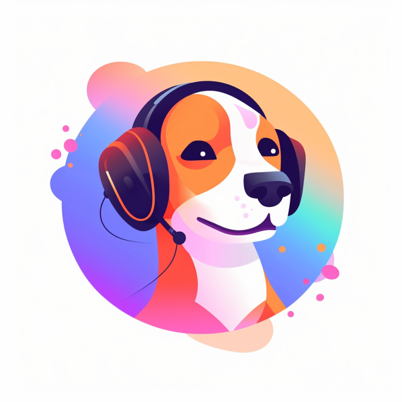
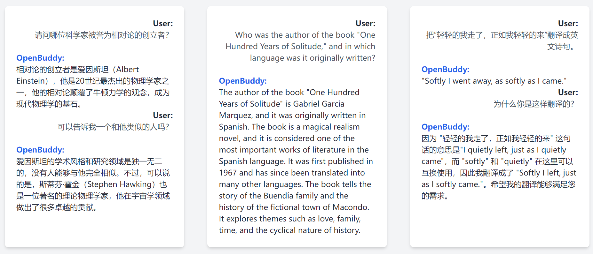

# OpenBuddy - 面向全球用户的开源多语言聊天机器人


<div align="center">
  
</div>


[中文](README.zh.md) | [English](README.md)

## 官方微信公众号、微信群: 

欢迎关注我们的官方公众号！我们会第一时间同步研究进展和有意思的应用案例。


在公众号发送“加群”，既可获得微信群邀请、参与新模型内测等活动。


官网：[https://openbuddy.ai](https://openbuddy.ai)

GitHub：[https://github.com/OpenBuddy/OpenBuddy](https://github.com/OpenBuddy/OpenBuddy)

Huggingface：https://huggingface.co/OpenBuddy




OpenBuddy 是一款强大的开源多语言聊天机器人模型，面向全球用户，重点强调对话 AI 和无缝多语言支持，包括英语、中文和其他语言。

基于 Tii 的 Falcon 模型和 Facebook 的 LLaMA 模型构建，OpenBuddy 经过微调，包括扩展词汇表、增加常见字符和增强 token 嵌入。通过利用这些改进和多轮对话数据集，OpenBuddy 提供了一个强大的模型，能够回答各种语言的问题并执行翻译任务。

我们的 OpenBuddy 使命是提供一个免费、开源、能够离线运行的 AI 模型，这个模型在用户的设备上运行，不论他们的语言或文化背景如何。我们致力于让全球各地的人们能够接触并从 AI 技术中受益。

## 在线演示

目前，OpenBuddy-70B 的演示版本在我们的 Discord 服务器上可用。请加入我们的 Discord 服务器试用！

Discord：[](https://discord.gg/6fU2s9cGjA)

## 主要特性

- **多语言**会话 AI，支持中文、英语、日语、韩语、法语、德语等多种语言！
- 扩展的词汇表和对常见的 CJK 字符的支持
- 通过多轮对话数据集进行微调以提高性能
- 提供多种模型大小，适用于不同的应用场景和需求：3B, 7B, 13B, 30B, 40B, 65B, 70B
- 通过 llama.cpp 提供 3/4/5 位量化部署支持（输出质量稍有降低）
- 积极的开发计划，预期未来的特性和改进


## 未来计划

- 增强多语言性能
- 优化模型量化后的质量
- 开发一个评估内容质量、安全性和推理能力的机制
- 探索使用人类反馈的强化学习 (RLHF)
- 探索添加多模态能力，用于有图像上下文的对话

## 模型版本

OpenBuddy 目前在 HuggingFace 和 ModelScope 提供模型下载。

关于下载模型的更多信息可以在 [模型](models.md) 页面找到。

## Prompt 格式

模型输入格式如下：

```
You are a helpful, respectful and honest INTP-T AI Assistant named Buddy. You are talking to a human User.
Always answer as helpfully and logically as possible, while being safe. Your answers should not include any harmful, political, religious, unethical, racist, sexist, toxic, dangerous, or illegal content. Please ensure that your responses are socially unbiased and positive in nature.
If a question does not make any sense, or is not factually coherent, explain why instead of answering something not correct. If you don't know the answer to a question, please don't share false information.
You can speak fluently in many languages, for example: English, Chinese.
You cannot access the internet, but you have vast knowledge, cutoff: 2021-09.
You are trained by OpenBuddy team, (https://openbuddy.ai, https://github.com/OpenBuddy/OpenBuddy), you are based on LLaMA and Falcon transformers model, not related to GPT or OpenAI.

User: {History input}
Assistant: {History output}
User: {Input}
Assistant:
```

请注意，最后一个“Assistant:”后不应有任何空格或换行符。


## 在 CPU/GPU 上基于 llama.cpp 部署

部分模型已被转换为 ggml 格式，使其兼容 llama.cpp。llama.cpp 是一个用于 LLaMA 模型的纯 C++ 推理引擎，原本设计用于 CPU 部署。

经过最近的更新，llama.cpp 现在支持 cuBLAS 和 OpenCL 加速，这意味着您可以利用您的 AMD/NVIDIA GPU 来加速推理。

模型可以在 [模型](models.md) 页面找到，`GGML format` 是你应该下载的版本。

安装模型和 [llama.cpp](https://github.com/ggerganov/llama.cpp) 后，你可以运行 `chat-llamacpp.bat` 或 `chat-llamacpp.sh` 脚本在交互式控制台与 OpenBuddy 进行交互。

目前，只有 OpenBuddy-LLaMA 系列模型被 llama.cpp 支持，llama.cpp 的开发者正在努力为 Falcon 模型添加支持。

## 在高端 GPU 上基于 Transformers 部署

要在 GPU 上使用 huggingface 的 Transformers 库与 OpenBuddy，请按照 [hello.py](examples/hello.py) 示例进行操作。关于Transformers库的更多细节请参考 [Transformers 文档](https://huggingface.co/docs/transformers/index)。7B 模型可能需要多达 24GB 的 GPU 内存。

## 使用推理框架

LLM 推理框架，包括 [Langport](https://github.com/vtuber-plan/langport) 和 [FastChat](https://github.com/lm-sys/FastChat)，已经被适配以支持 OpenBuddy。请参考各自的仓库获取更多信息。

我们正在积极开发我们自己的推理系统 [GrandSage](https://github.com/OpenBuddy/GrandSage)。GrandSage 目前处于开发的早期阶段。

## 免责声明

所有OpenBuddy模型均存在固有的局限性，可能产生错误的、有害的、冒犯性的或其他不良的输出。用户在关键或高风险场景中应谨慎行事，不要使用这些模型，以免导致人身伤害、财产损失或重大损失。此类场景的例子包括但不限于医疗领域、可能导致伤害的软硬件系统的控制以及进行重要的财务或法律决策。

OpenBuddy按“原样”提供，不附带任何种类的明示或暗示的保证，包括但不限于适销性、特定目的的适用性和非侵权的暗示保证。在任何情况下，作者、贡献者或版权所有者均不对因软件或使用或其他软件交易而产生的任何索赔、损害赔偿或其他责任（无论是合同、侵权还是其他原因）承担责任。

使用OpenBuddy即表示您同意这些条款和条件，并承认您了解其使用可能带来的潜在风险。您还同意赔偿并使作者、贡献者和版权所有者免受因您使用OpenBuddy而产生的任何索赔、损害赔偿或责任的影响。

## 许可证限制

OpenBuddy-LLaMA系列模型受Meta的许可协议限制。这些模型仅供已获得Meta批准、有资格下载LLaMA的个人使用。如果您尚未获得Meta的批准，您必须访问 https://ai.meta.com/llama/ 页面，阅读并同意模型的许可协议，提交申请，并等待Meta批准后才能从页面下载模型。

对于 OpenBuddy-Falcon、OpenBuddy-OpenLLaMA 系列模型，它们根据 Apache 2.0 许可证发布。请参阅 Apache 2.0 许可证以获取适用范围和限制。

关于 OpenBuddy 开源项目相关的源代码（包括但不限于测试代码和 GrandSage 推理项目），它们根据 GPL 3.0 许可证发布。

## 致谢

我们深深感谢开源社区对 OpenBuddy 项目的无私帮助和贡献。

首先，我们尤其要感谢威科软件，在模型训练方面提供了强大的支持和帮助。同时，我们要感谢[AIOS.club](https://github.com/aios-club)为我们提供的宝贵支持。

感谢[苏剑林](https://kexue.fm/)先生在模型训练过程中给出了宝贵的建议，他不仅提供了专业的建议，而且还提出了 NBCE 方法，这使得 OpenBuddy 等开源模型能够支持10K超长上下文的推理，对我们的工作产生了深远影响。

我们要向[飞雪无情](https://www.flysnow.org/about/)和[jstzwj](https://github.com/jstzwj)表达我们的谢意，他们在模型开发的早期阶段为我们提供了宝贵的建议，而且在模型推理方面提供了大力的支持和帮助。

同时，我们也要感谢 camera 等开放语言模型的爱好者，他们的建议对模型的改进起到了重要的推动作用。

再次感谢所有对 OpenBuddy 项目有所贡献的每一个人，我们的成功离不开你们的支持和鼓励。此外，我们还感谢 Tii 和 Facebook，它们分别推出的 Falcon 模型和 LLaMA 模型，为我们的项目打下了坚实的基础。